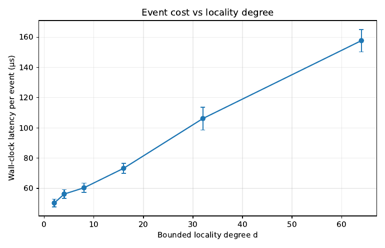
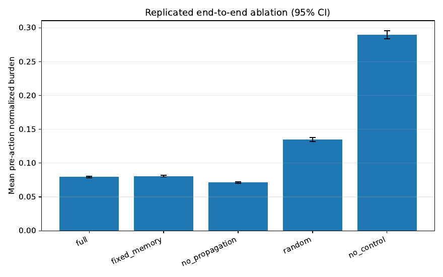
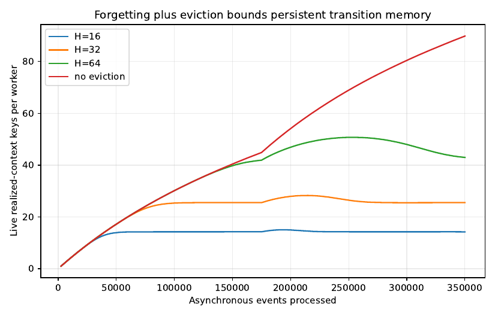
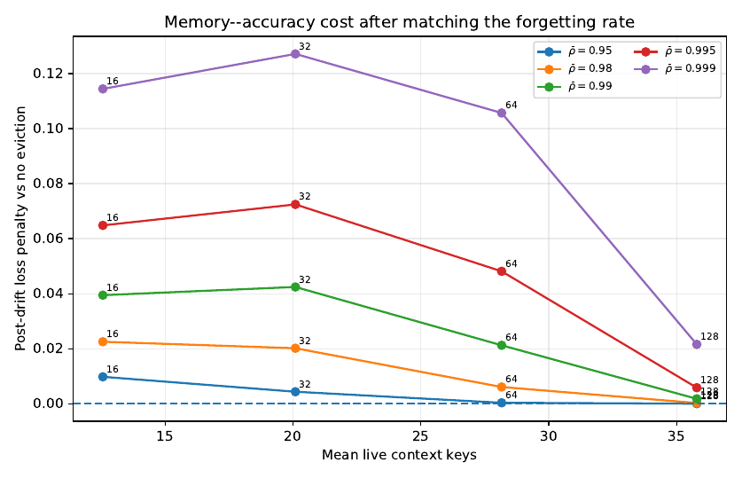
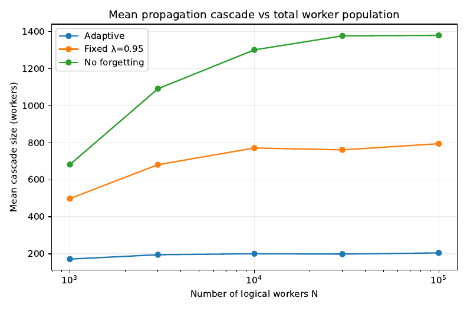
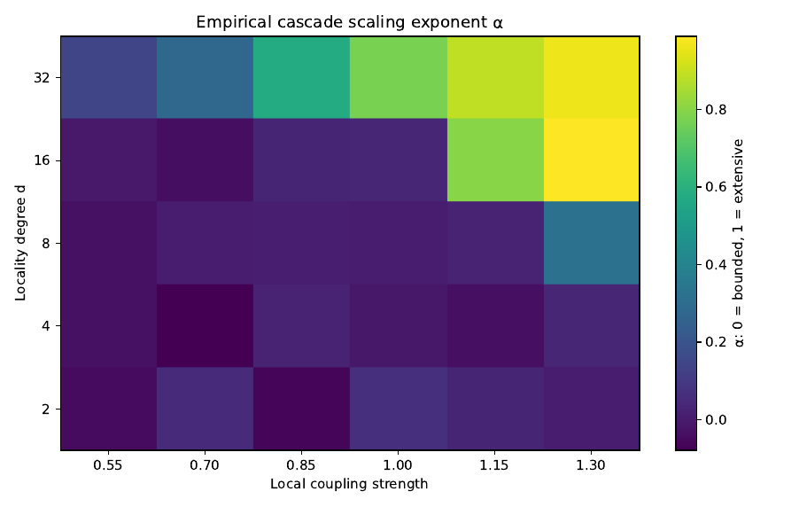
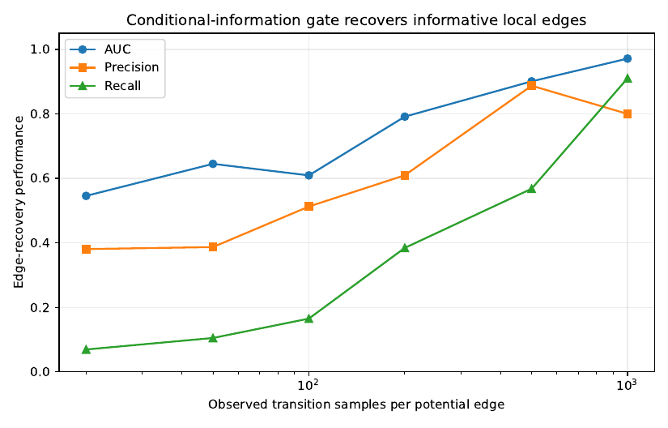
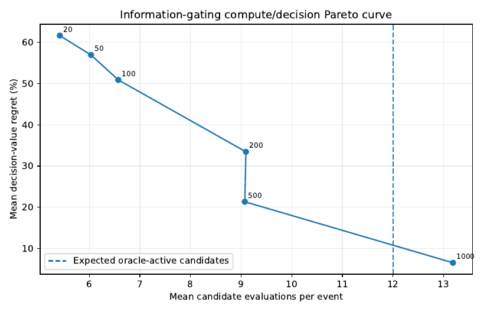
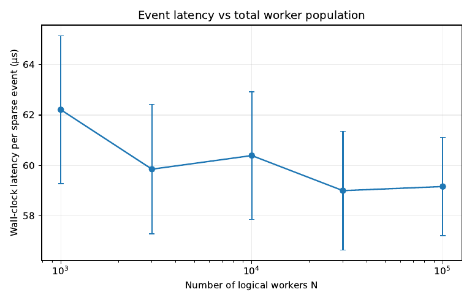
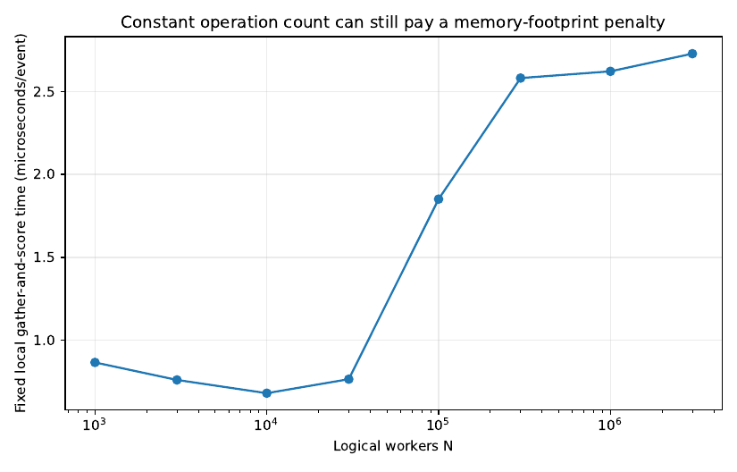

# Asynchronous Agentic Orchestration at Scale

Reference implementation, experiment archive, and reproducibility package for the paper
**Asynchronous Agentic Orchestration at Scale**.

The central systems question is simple:

> If a system contains tens or hundreds of thousands of agents, but only a few agents
> produce new information at a given instant, why should the orchestrator recompute over
> the entire population?

This repository develops and tests an event-local answer. The orchestration layer is
built around sparse push events, bounded structural locality, worker-local state
learning, sparse transition memory with forgetting and eviction, local constrained
intervention, exact sharded resource reservation, and concurrent processing of events
whose mutable read/write footprints do not conflict.

The architecture is deliberately **agent-model agnostic**. An agent can be a neural
model, symbolic solver, simulator, theorem prover, planner, sensor process, search
process, or another computational worker. There is no LLM requirement and no GPU
requirement in the orchestration layer.

The repository contains:

- the reference Python implementation under `src/async_agentic_orchestration/`;
- all raw CSV outputs used in the paper under `results/reference/`;
- all vector paper figures under `figures/reference/`;
- a complete script that rebuilds the paper figures from the committed raw outputs;
- the fixed-seed revision experiment scripts used for the later memory, concurrency,
  queueing, and one-swap studies;
- unit tests for the core orchestration mechanisms;
- a minimal end-to-end usage example.

The exact manuscript values are reproduced from the committed raw output archive. Fresh
wall-clock timing runs will vary across CPUs, cache hierarchies, Python/NumPy builds,
BLAS implementations, and operating systems.

---

## 1. The operating regime

Let there be `N` agents,

\[
V_N=\{1,\ldots,N\}.
\]

Each agent has a small symbolic state

\[
Z_i(t)\in\mathcal Z,\qquad |\mathcal Z|=K,
\]

but the orchestrator is not driven by synchronized global rounds. It is driven by
asynchronous push events.

At event `t`, only a response set

\[
\Omega_t\subseteq V_N
\]

has produced new information. The intended regime is

\[
|\Omega_t|\ll N.
\]

The practical architecture is built around the size of this event, not the size of the
installed system.

The other key structural contract is bounded locality. An undirected structural graph
specifies which agents may directly interact. For each agent `i`, the local neighborhood
`N(i)` is small relative to the total population. Sparse response alone does not imply
locality: the two are separate properties. A sparse event in a globally coupled system
can still require global work.

The framework therefore applies to the regime

\[
\text{sparse asynchronous activity} + \text{bounded local interaction}.
\]

When either part fails, the method is not supposed to hide it.

---

## 2. Why the obvious global constructions are the wrong runtime primitives

The architecture was developed by starting from several natural global constructions and
removing them one by one.

### 2.1 Joint dynamic programming

A joint symbolic state is

\[
Z_t=(Z_1(t),\ldots,Z_N(t)),
\]

so a generic table over the joint state has `K^N` entries. An exact joint Viterbi-style
recursion has the form

\[
C_t(z_t)=\phi_t(z_t)+\min_{z_{t-1}}
\big[C_{t-1}(z_{t-1})+\Psi_t(z_{t-1},z_t)\big].
\]

This representation is unsuitable for the runtime of a very large persistent system.
The final controller does **not** maintain a global dynamic-programming table and does
not reconstruct a global posterior after every event.

### 2.2 Global action scanning

Even if state inference is local, scanning every possible intervention after every event
reintroduces direct dependence on `N`. If only the responding agents and their bounded
structural neighborhoods can have nonzero immediate intervention gain, the natural
candidate set is

\[
\mathcal C_t=\bigcup_{i\in\Omega_t}\mathcal A(i),
\]

where `A(i)` is the bounded action neighborhood of agent `i`.

The local-versus-global experiment makes this distinction explicit. At `N=300,000`, the
local procedure took about `379 µs` while the naive global scan took about `17.1 ms`, a
`45.25x` timing ratio in the tested implementation. Both returned the same effective
decision gain because the experiment deliberately placed nonzero gains inside the known
structural contract.



### 2.3 Dense transition tensors

A bounded local context can still have a large formal Cartesian product. Allocating a
dense table for every possible context is unnecessary because most contexts are never
visited.

The implementation therefore allocates a transition record only when a context actually
occurs:

```text
(agent i, realized context c) -> K-vector of empirical counts
```

This changes storage from the size of the *formal context space* to the size of the
*realized operating history*.

Sparse allocation alone does not solve persistent lifetime growth. That is why the final
version combines sparse allocation with explicit eviction, described below.

### 2.4 Automatic belief propagation

A structural edge means that influence may occur. It does **not** mean that the posterior
state of one agent should be copied or diffused into another agent.

The first integrated controller did exactly that. Repeated ablation showed that it was a
bad idea. In six paired environments, the no-propagation controller had lower mean
pre-action risk than the adaptive-propagation controller in all six runs.

Mean risks:

| controller | mean pre-action risk |
|---|---:|
| no cross-agent propagation | 0.071261 |
| adaptive propagation | 0.079512 |
| fixed propagation/memory | 0.080671 |
| random feasible control | 0.134869 |
| no control | 0.289823 |

The paired risk difference `no propagation - full` was

\[
-0.008251,
\]

with a Student-`t` 95% interval approximately

\[
[-0.009509,-0.006992].
\]



The final default is therefore:

> Update the state estimate of a responding agent because it responded. Do not update a
> neighbor merely because it is adjacent.

Structural locality remains crucial for transition context, action generation, cascade
analysis, and conflict ownership. It is not an automatic inference rule.

---

## 3. Push-based asynchronous event clock

Agents push results to the orchestrator. The orchestrator does not repeatedly scan all
agents to discover who changed.

Each event provides at least:

```text
Event
  event_id
  responders: Omega_t
  observations for responders
  elapsed time since each responder's previous report
```

This is important because an event-local algorithm is useful only if event discovery is
itself event-driven. A hidden population scan would destroy the point of the design.

The main event loop is therefore organized around arriving responder IDs.

---

## 4. Local symbolic state learning

Each agent maintains a local state distribution

\[
\pi_i(q)=P(Z_i=q\mid\text{stored local information}),
\qquad q\in\mathcal Z.
\]

When agent `i` responds, the orchestrator constructs a realized local context. A typical
context contains:

- the agent's own cached state representation;
- bounded structural-neighbor summaries;
- relevant cached action state;
- a bin for elapsed time since the agent last responded;
- where needed, bins describing staleness of cached neighbor information.

The implementation intentionally avoids using a hard decoded symbol as the only Bayesian
state representation. Hard decisions can be used for compact context indexing when an
application wants them, but the state posterior itself remains available.

A smoothed local transition estimate is

\[
\widehat T_i(q\mid c)=
\frac{n_i(c,q)+\alpha p_{0,i}(q\mid c)}
{\sum_r n_i(c,r)+\alpha}.
\]

The observation likelihood is fused locally:

\[
\pi_{i,t}(q)\propto
L_i(Y_{i,t}\mid q)\widehat T_i(q\mid C_{i,t}).
\]

Only agents in `Omega_t` receive this update.

---

## 5. Elapsed time is handled by bins, deliberately

The system is asynchronous, so elapsed time matters. The implementation does not require
a continuous-time Markov model. It uses a finite elapsed-time map

\[
b(\Delta t)\in\{1,\ldots,B\}.
\]

The bin edges may be fixed by the application or estimated from empirical quantiles.

The paper tested 1, 2, 4, 8, 16, 32, and 64 bins. Held-out log loss was:

| bins | mean held-out log loss |
|---:|---:|
| 1 | 1.0618 |
| 2 | 1.0454 |
| 4 | 1.0379 |
| 8 | 1.0354 |
| 16 | 1.0357 |
| 32 | 1.0392 |
| 64 | 1.0474 |

The practical optimum in this synthetic test was around 8--16 bins. More temporal
resolution eventually increased variance rather than improving prediction.

---

## 6. Forgetting: adaptation without permanent historical commitment

Persistent systems drift. Transition counts therefore use exponential forgetting.

For a realized context `c`, empirical counts are discounted approximately as

\[
n_r(c,\cdot)=\rho_r n_{r-1}(c,\cdot)+e_r,
\]

where `e_r` is the new observation increment.

The implementation applies this decay lazily. A key remembers its last local-response
stamp. When the key is accessed again, the accumulated factor is applied once. This
avoids touching every stored key on every event.

On a six-state transition process with an abrupt midstream change, late post-drift log
loss was:

| forgetting factor `rho` | late post-drift log loss |
|---:|---:|
| 1.0000 | 1.6769 |
| 0.9995 | 1.5693 |
| 0.9990 | 1.5728 |
| 0.9950 | 1.6106 |
| 0.9900 | 1.6684 |

Moderate forgetting improved adaptation; aggressive forgetting paid a variance penalty.

---

## 7. Sparse memory still needs eviction

A sparse dictionary avoids a dense combinatorial tensor, but a persistent system can
still accumulate keys forever. The final design therefore gives every agent an
expiration deque.

For each local response of agent `i`:

1. increment the local response clock;
2. pop expiration records older than the configured horizon `H`;
3. delete a context only when the popped stamp is still its most recent access;
4. access or create the current context;
5. append its new `(stamp, key)` record to the deque.

Stale duplicate deque records are harmless. Each local response inserts one deque record
and eventually removes at most one corresponding record, so the maintenance cost is
amortized constant time per local response.

The implementation is in
[`SparseTransitionMemory`](src/async_agentic_orchestration/memory.py).

A design horizon can be translated from a forgetting upper bound and tolerance by
requiring the unobserved geometric tail to be small:

\[
\frac{\bar\rho^H}{1-\bar\rho}\le\varepsilon.
\]

Equivalently,

\[
H\ge
\frac{\log(\varepsilon(1-\bar\rho))}{\log \bar\rho}.
\]

This conversion can produce very long horizons when forgetting is weak. For example,
with `epsilon=0.01`, `rho_bar=0.999` gives a horizon on the order of `1.15e4` local
responses. That is why `rho` and `H` must be treated as a joint engineering choice.



### 7.1 Joint forgetting/eviction result

The final experiment corrected an earlier implementation mismatch: the empirical counts
are decayed, but the Bayesian prior pseudo-counts are fixed, exactly as in the estimator
above.

Six independent streams were run per `(rho, H)` cell. At `rho=0.995`:

| H | post-drift log loss | mean live keys |
|---:|---:|---:|
| 16 | 1.6367 | 12.57 |
| 32 | 1.6443 | 20.09 |
| 64 | 1.6200 | 28.16 |
| 128 | 1.5777 | 35.79 |
| infinity | 1.5719 | 96.00 |

The correct conclusion is not that eviction is an accuracy trick. Eviction is a memory
control mechanism with a tunable prediction cost. The forgetting rate and lifetime
horizon must be tuned together.




Persistent memory is therefore bounded in *operating age*, not independent of the number
of installed agents. If every agent keeps a bounded number of finite-state count vectors
and expiration records, total persistent state still scales linearly with `N`.

---

## 8. Structural candidate generation

Let `A(i)` be the actions that can immediately matter for agent `i` under the application's
structural contract. The event-local candidate set is

\[
\mathcal C_t=\bigcup_{i\in\Omega_t}\mathcal A(i).
\]

If every responder has at most `a` local actions, then the event candidate set cannot
contain more than `a |Omega_t|` actions before duplicate removal.

This simple step is the main mechanism that prevents action selection from becoming a
population scan.

### Optional spatial-decay extension

Some applications can justify a distance-dependent influence law of the form

\[
0\le J_t^*(\infty)-J_t^*(\kappa)\le D\rho^{\kappa+1},
\qquad 0<\rho<1.
\]

The left inequality follows from nested feasible sets; the application only needs to
supply the upper decay law.

A tolerance `epsilon` translates into

\[
\kappa\ge \frac{\log(\varepsilon/D)}{\log\rho}-1.
\]

This is a parameter translation, not a universal locality guarantee. The resulting
neighborhood can be uselessly large. For degree `d=8` and `epsilon/D=0.01`:

| `rho` | radius `kappa` | tree-ball upper bound |
|---:|---:|---:|
| 0.3 | 3 | 457 |
| 0.5 | 6 | 156,865 |
| 0.7 | 12 | 18,455,049,601 |

At moderate decay, a derived radius can exceed the entire population. The fixed
one-hop/bounded-neighborhood structural contract is therefore the default mechanism in
this repository. Spatial decay is only useful when a domain can actually justify a fast
decay rate.

For `d=2`, the tree-ball expression is the separate linear form `1 + 2 kappa`. On graphs
with short cycles, tree-ball counting is an upper bound before duplicate removal and may
over-count heavily.

---

## 9. Cascades are an optional extension, not a hidden assumption

A bounded local graph can still produce a large cascade if local effects reproduce too
strongly. The synthetic cascade stress test therefore separates two regimes:

- subcritical-like local propagation, where affected-set size remains modest over the
  tested range;
- extensive propagation, where a local event can expand to a substantial fraction of the
  population.

The runtime does not call both regimes "scalable".

A useful operational quantity is the number of newly activated children produced by an
active parent. If the conditional reproduction level is below one, expected cascade size
has a geometric form. But the online estimator is only a lagging diagnostic; it cannot
prevent the first unexpected supercritical event.

The package therefore combines two mechanisms:

1. a rolling Azuma-style upper diagnostic for the recent average conditional offspring
   rate;
2. an unconditional hard cap on the number/radius of agents an event is allowed to
   activate before being stopped or escalated.

The diagnostic is implemented in
[`RollingCascadeDiagnostic`](src/async_agentic_orchestration/cascade.py).

### Cascade stress results

Four seed responders, degree eight:

| N | adaptive mean cascade | adaptive p95 | fixed `lambda=0.95` mean | no-forgetting mean |
|---:|---:|---:|---:|---:|
| 1,000 | 171.6 | 280.1 | 498.3 | 682.3 |
| 3,000 | 195.0 | 317.1 | 681.3 | 1,091.7 |
| 10,000 | 200.3 | 330.1 | 771.5 | 1,301.6 |
| 30,000 | 198.4 | 333.0 | 761.6 | 1,377.3 |
| 100,000 | 204.9 | 341.0 | 794.7 | 1,379.9 |

The mean cascade of roughly 205 from four seeds is operationally substantial even though
it is only about 0.205% of `N=100,000`.



### Finite-range phase diagnostic

Degree and coupling strength were swept over 30 cells. A two-population log-log slope was
used only as a descriptive finite-range diagnostic. Of the 30 cells:

- 21 were bounded-like under the chosen threshold;
- 3 were intermediate;
- 6 were clearly extensive-like.

At high degree and strong coupling, the observed exponent approached one.



This is not presented as a universal phase-transition theorem. It is a stress test that
shows exactly where the local architecture should stop pretending that a cascade is
small.

---

## 10. Local constrained intervention

The local objective is application-defined:

\[
J_t(A),\qquad A\subseteq\mathcal C_t.
\]

The runtime does not assume submodularity.

For a current selected set `A`, the marginal gain of candidate `j` is

\[
\Delta_j(A)=J_t(A\cup\{j\})-J_t(A).
\]

There may be several hard resource budgets and pairwise conflicts. Let action `j` have
resource vector `c_j`, with shard-local budget `B`. The default score is the gain divided
by normalized resource consumption:

\[
\text{score}_j(A)=
\frac{\Delta_j(A)}{\sum_r c_{jr}/B_r}.
\]

At every step:

1. drop candidates that violate remaining resource capacity;
2. drop candidates conflicting with already selected actions;
3. compute local marginal gains;
4. select the highest positive gain/resource score;
5. stop when no positive feasible marginal remains or the action cap is reached.

The implementation is
[`ratio_greedy`](src/async_agentic_orchestration/intervention.py).

### Greedy versus exact

On random non-submodular quadratic local objectives, at 18 candidates the original
unconstrained greedy experiment gave about `2.10%` mean regret and `9.04%` p95 regret,
while exhaustive search was roughly three orders of magnitude slower in that small-set
benchmark.

For resource- and conflict-constrained instances, the gain/resource score outperformed
raw marginal and a simple scarcity-price rule in the tested distribution.

### One-swap refinement

Greedy versus exhaustive is not the only choice. A single best-improving add/swap pass
costs `O(|C_t|^2)` local evaluations and closes much of the gap at modest local sizes.

On 50 paired instances per candidate count:

| candidates | ratio-greedy mean regret | one-swap mean regret | paired improvement | greedy runtime | one-swap runtime | exact runtime |
|---:|---:|---:|---:|---:|---:|---:|
| 8 | 4.11% | 1.44% | 2.68 pp | 0.66 ms | 0.94 ms | 2.75 ms |
| 10 | 4.51% | 1.93% | 2.59 pp | 0.70 ms | 1.03 ms | 6.54 ms |
| 12 | 5.92% | 3.19% | 2.72 pp | 1.18 ms | 1.56 ms | 14.89 ms |
| 14 | 7.45% | 4.86% | 2.59 pp | 1.41 ms | 2.22 ms | 31.80 ms |
| 16 | 6.76% | 3.24% | 3.52 pp | 1.66 ms | 2.29 ms | 61.42 ms |

At 16 candidates the paired 95% half-width for the regret reduction is about 1.37
percentage points, and the swap improved 30 of 50 instances.


The repository exposes both algorithms. Use ratio greedy when latency is dominant; add a
single swap pass when the local candidate set is still small enough that the extra
quadratic local work is acceptable.

---

## 11. Exact sharded resource feasibility

A global resource counter would be touched by every concurrent event and would therefore
make all event write sets overlap. The architecture avoids that contradiction by
partitioning resource budgets across controller shards before an allocation epoch.

Suppose global budget `B` is partitioned as

\[
B=\sum_{p=1}^{P} B^{(p)}.
\]

An event is routed to one shard and can reserve only against the shard-local ledger during
that epoch. Because the shard allocation is already feasible globally, exact local
reservation preserves global feasibility within the epoch.

Truly shared intervention objects that cannot be assigned to an agent owner are handled
through the same serialized shard-ledger layer. They are not incorrectly hidden inside
the exchangeable agent-owner collision calculation.

The reference implementation is
[`ShardBudgetLedger`](src/async_agentic_orchestration/sharding.py).

---

## 12. Concurrency uses the complete mutable footprint

Two events can execute without synchronization only when they do not create a mutable
read/write conflict.

For an event, define an agent-owner footprint containing the owners of mutable state that
is read or written by that event. It includes, for example:

- responding state entries;
- cached neighbor state entries that are read;
- transition-memory entries touched by the event;
- agent-owned action state;
- other mutable agent-indexed local coordinates.

The collision model requires **conditional independence of footprint locations given
footprint sizes**, together with exchangeability/uniformity over the owner population.
Marginal exchangeability alone is not enough.

Under owner-independent routing, two sparse independent footprints have overlap
probability of order `|F_t||F_u|/N`. If events are routed by owner into `P` balanced
shards, the relevant owner population within a shard is approximately `N/P`, producing a
factor-`P` penalty relative to the global uniform calculation.

Independence of footprint *locations* is required for this collision argument; the
footprint *sizes* themselves need not be independent for the later second-moment bound.

### Measured overlap

With four responders and degree-eight local touched sets:

| N | 2 concurrent | 4 concurrent | 8 concurrent |
|---:|---:|---:|---:|
| 10,000 | 0.0652 | 0.3176 | 0.8240 |
| 30,000 | 0.0228 | 0.1288 | 0.4328 |
| 100,000 | 0.0068 | 0.0412 | 0.1556 |
| 300,000 | 0.0028 | 0.0124 | 0.0488 |


The finite-size constant matters. A cascade-sized footprint around 205 agents can make the
simple overlap bound poor even when the asymptotic factor is `1/N`. Concurrency is
therefore tied to the *actual footprint second moment*, not merely to graph degree.

---

## 13. Conditional mutual information is a diagnostic, not the default gate

For a potential local edge `j -> i`, the repository estimates

\[
I\big(Z_j(t);Z_i(t+1)\mid Z_i(t)\big).
\]

If this conditional mutual information is zero, the neighbor contributes no additional
one-step predictive information once the target's own state is known.

The plug-in estimator and a permutation-null threshold are implemented in
[`cmi.py`](src/async_agentic_orchestration/cmi.py).

The paper also connects small CMI to small one-step decision value through the standard
Pinsker/Bayes-risk argument. The important limitation is that this is a one-step
statement; it is not a cumulative sequential-control regret guarantee.

### Edge recovery

Synthetic edge recovery improved with samples:

| samples/edge | precision | recall | AUC |
|---:|---:|---:|---:|
| 20 | 0.381 | 0.070 | 0.546 |
| 50 | 0.387 | 0.105 | 0.645 |
| 100 | 0.513 | 0.165 | 0.609 |
| 200 | 0.610 | 0.385 | 0.792 |
| 500 | 0.888 | 0.568 | 0.901 |
| 1000 | 0.800 | 0.911 | 0.972 |



But the systems result is negative.

At 1000 samples per potential edge, the CMI gate reduced about 36 structural candidate
evaluations to about 13.18, but mean decision regret relative to the exact local optimum
was about `6.53%`. Evaluating the complete structural-local set with greedy gave about
`3.83%` mean regret in the corresponding comparison.



The sample acquisition cost is also severe. With four responders per event and uniform
response frequencies,

\[
E[n_{\text{edge}}]\approx \frac{4T}{N}.
\]

Five hundred expected samples per worker-specific edge therefore require roughly:

- `125,000` events at `N=1,000`;
- `1.25 million` events at `N=10,000`;
- `12.5 million` events at `N=100,000`.

The default runtime therefore keeps the small structural candidate set rather than
waiting for worker-specific CMI estimates. CMI is useful as a diagnostic, as a mature
system refinement, or potentially as a way to calibrate spatial-dependence decay when
statistics can be pooled across genuinely exchangeable agent classes.

---

## 14. Operation count is not physical independence from N

The algorithmic claim is intentionally narrower than "runtime is independent of N."

If response support and structural local work remain bounded, the number of arithmetic
operations triggered by a normal event can remain approximately flat as `N` grows. The
basic synthetic kernel demonstrates this:

| N | mean event latency | mean touched agents |
|---:|---:|---:|
| 1,000 | 62.21 µs | 35.51 |
| 3,000 | 59.85 µs | 35.84 |
| 10,000 | 60.39 µs | 35.95 |
| 30,000 | 59.00 µs | 35.98 |
| 100,000 | 59.16 µs | 36.00 |



However, persistent per-agent state is still `Theta(N)`. A real machine pays for cache
misses, TLB behavior, memory capacity, allocator behavior, and random access into a larger
backing array.

A fixed-local-work microbenchmark touched the same number of rows at every `N`, but grew
the backing state from `0.06 MB` to `183 MB`. Median time rose from below one microsecond
to roughly `2.7 µs/event`.



The integrated controller showed the same effect: its measured latency rose by roughly
40% across the tested population range even though the event-local arithmetic structure
was unchanged.

The physically honest claim is therefore:

> Event locality can make the operation count triggered by a normal event independent of
> installed population and can remove a large amount of unnecessary global work. It does
> not make the persistent state or the memory hierarchy independent of `N`.

---

## 15. Queueing becomes the next bottleneck

Once the per-event algorithm is local, throughput is controlled by ordinary service
capacity.

For event arrival rate `lambda`, mean service time `E[S]`, and `P` controller shards,

the normalized offered load is

\[
\rho=\frac{\lambda E[S]}{P}.
\]

The queue experiment uses gamma service times so that the service distribution has a
finite moment-generating function near zero, consistent with the tail analysis used in
the paper.

For four shards:

| load | p95 wait / mean service | probability event waits |
|---:|---:|---:|
| 0.70 | 1.05 | 0.414 |
| 0.80 | 1.87 | 0.588 |
| 0.90 | 4.01 | 0.779 |
| 0.95 | 7.60 | 0.887 |
| 0.98 | 15.93 | 0.952 |


The architecture should therefore be provisioned well below saturation. Locality removes
population-scale wasted work; it does not remove queueing theory.

---

## 16. Complete orchestration algorithm

The production-style algorithm implemented by this repository is:

```text
INPUT
    structural neighborhoods N(i)
    structural action neighborhoods A(i)
    finite symbolic state alphabet Z
    local transition priors
    elapsed-time binning rule
    forgetting rate rho
    memory horizon H
    shard-local resource budgets
    conflict rules
    application objective J_t

STATE
    per-agent state posterior pi_i
    cached local/neighbor summaries
    SparseTransitionMemory for each agent
    per-shard resource ledger
    optional cascade diagnostic

ON PUSH EVENT t
    receive responder set Omega_t

    for each responding agent i in Omega_t:
        compute elapsed time since i last responded
        bin elapsed time
        construct realized local context C_i,t

        retrieve sparse transition record for C_i,t
        lazily apply accumulated forgetting to empirical counts
        combine transition prediction with new observation
        update only pi_i
        record the realized transition observation
        evict expired keys using the local-response expiration deque

    construct local candidate set
        C_t = union_{i in Omega_t} A(i)

    optionally:
        apply a domain-supplied spatial radius
        apply a hard cascade radius / affected-set cap
        evaluate mature-system dependency diagnostics

    score feasible local interventions
        marginal gain Delta_j(A)
        normalized resource use sum_r c_jr / B_r
        score = Delta_j(A) / normalized_resource_use

    run feasibility-preserving ratio greedy

    optionally run one best-improving add/swap pass

    atomically reserve required capacity from the event's shard ledger

    dispatch selected interventions

    construct complete mutable read/write owner footprint

    process concurrently only with events that do not conflict
```

The Python reference implementation is intentionally small enough to read directly:

- [`memory.py`](src/async_agentic_orchestration/memory.py)
- [`intervention.py`](src/async_agentic_orchestration/intervention.py)
- [`sharding.py`](src/async_agentic_orchestration/sharding.py)
- [`cascade.py`](src/async_agentic_orchestration/cascade.py)
- [`cmi.py`](src/async_agentic_orchestration/cmi.py)
- [`controller.py`](src/async_agentic_orchestration/controller.py)

---

## 17. What the final architecture deliberately does not do

The final runtime does not require:

- a global synchronized round;
- a global posterior or joint dynamic-programming table;
- a dense transition tensor;
- a population-wide action scan;
- automatic posterior diffusion across structural edges;
- submodularity;
- exact knapsack or exhaustive local action search;
- worker-specific CMI estimates at startup;
- a GPU;
- a particular internal agent model.

The two principal negative results are part of the design, not embarrassing side notes:

1. structural adjacency did not justify automatic belief propagation;
2. worker-specific CMI pruning required too much evidence and paid too much decision
   regret to be the default mechanism.

The architecture became simpler because those ideas were tested and removed.

---

## 18. Experimental map

The paper's experiments are mechanism tests, not an application leaderboard. They ask
whether the proposed operating regime behaves as intended and where it fails.

### A. Population, response-support, and locality scaling

Files:

- `scaling_vs_N.csv`
- `scaling_vs_response_sparsity.csv`
- `scaling_vs_locality_degree.csv`
- `local_vs_global_candidate_scan.csv`
- `fixed_local_work_memory_footprint.csv`
- `end_to_end_scaling_replicated_summary.csv`

Main observations:

- the small local event kernel is effectively flat in `N` over `1e3` to `1e5`;
- latency grows with the number of responders and locality degree;
- ignoring a known structural action contract creates a growing global-scan penalty;
- integrated wall-clock latency still rises with `N` because the backing state grows.

### B. Cascade stress and operating regimes

Files:

- `cascade_sizes_raw.csv`
- `cascade_scaling_summary.csv`
- `phase_boundary_raw.csv`
- `phase_boundary_summary.csv`
- `response_sparsity_cascade_raw.csv`
- `collision_bound_write_set_sensitivity.csv`

Main observations:

- adaptive attenuation stabilizes the mean cascade over the largest tested populations
  in the chosen synthetic regime;
- fixed attenuation and no forgetting produce much larger affected sets;
- sufficiently high degree and coupling produce clearly extensive behavior;
- cascade-sized footprints can destroy practical event-level parallelism even though the
  asymptotic collision factor still contains `1/N`.

### C. Sparse memory, forgetting, eviction, and time bins

Files:

- `sparse_context_storage.csv`
- `eviction_memory_growth.csv`
- `eviction_rho_h_joint_raw.csv`
- `eviction_rho_h_joint_sweep.csv`
- `theoretical_eviction_horizons.csv`
- `online_transition_learning_drift.csv`
- `time_binning_raw.csv`
- `time_binning_summary.csv`

Main observations:

- sparse allocation avoids the formal dense context tensor;
- explicit eviction is necessary to stop lifetime key growth;
- eviction and forgetting must be tuned jointly;
- moderate forgetting helps after drift;
- coarse elapsed-time bins are sufficient in the tested process.

### D. Local action selection

Files:

- `greedy_vs_exact.csv`
- `constrained_greedy_raw.csv`
- `constrained_greedy_summary.csv`
- `greedy_swap_paired_raw.csv`
- `greedy_swap_paired_summary.csv`

Main observations:

- local greedy is far cheaper than exhaustive local search;
- gain/resource scoring was the best of the tested simple constrained rules;
- one best-improving swap closes a meaningful part of the remaining gap while staying far
  below exhaustive-search cost at the larger tested candidate sets.

### E. Asynchrony, CPU execution, and queueing

Files:

- `async_vs_sync_throughput.csv`
- `multicore_speedup.csv`
- `queue_stability_gamma_summary.csv`
- `concurrent_event_overlap.csv`

At service-time coefficient of variation one, the asynchronous/barrier throughput ratio
was about `5.34x` in the scheduling stress test. Independent local rollouts achieved
roughly `3x` CPU speedup on four useful processes in the original runtime. Queue delay
then becomes severe as offered load approaches one.

### F. Integrated controller and propagation falsification

Files:

- `end_to_end_metrics.csv`
- `end_to_end_*_trace.csv`
- `end_to_end_replications_raw.csv`
- `end_to_end_replications_summary.csv`
- `paired_differences_t_intervals.csv`
- `propagation_vs_coupling_raw.csv`
- `propagation_vs_coupling_summary.csv`
- `propagation_coupling_advantage.csv`

The central result is the replicated failure of automatic cross-agent state propagation.
Increasing the actual physical coupling in the environment did not produce a crossover in
the tested range.

### G. Conditional-information diagnostics

Files:

- `cmi_edge_recovery_raw.csv`
- `cmi_edge_recovery_summary.csv`
- `cmi_candidate_reduction.csv`
- `cmi_gate_decision_tradeoff.csv`
- `cmi_sample_complexity_analytic.csv`
- `cmi_edge_sample_coverage.csv`

The statistical edge detector becomes accurate after enough samples, but the evidence
requirement scales poorly with population when each individual agent responds rarely.
That is why CMI remains a diagnostic rather than the startup/default candidate gate.

---

## 19. Reproducing the results

### 19.1 Environment

Python 3.10 or newer is recommended.

```bash
python -m venv .venv
source .venv/bin/activate        # Windows: .venv\Scripts\activate
pip install -r requirements.txt
pip install -e .
```

Run the tests:

```bash
pytest -q
```

### 19.2 Exact manuscript-data reproduction

All fixed-seed raw outputs are committed in `results/reference/`. Rebuild every paper
figure from those CSVs with:

```bash
python experiments/run_all.py
```

This writes PNG and PDF plots to:

```text
figures/reproduced/
```

This is the correct path for checking exact reported values because it does not contaminate
results with a different machine's timing behavior.

### 19.3 Fresh revision experiments

To rerun the later bounded-memory, footprint, one-swap, and queue experiments on the
current machine:

```bash
python experiments/run_all.py --fresh-revision
```

Fresh outputs are written to:

```text
results/fresh/
figures/fresh/
```

CPU timing values are expected to change. Statistical conclusions should be compared,
not individual microseconds.

### 19.4 Minimal controller example

```bash
python examples/minimal_controller.py
```

---

## 20. Repository layout

```text
Asynchronous-Agentic-Orchestration-at-Scale/
├── README.md
├── CITATION.cff
├── pyproject.toml
├── requirements.txt
├── src/
│   └── async_agentic_orchestration/
│       ├── __init__.py
│       ├── memory.py
│       ├── intervention.py
│       ├── sharding.py
│       ├── cascade.py
│       ├── cmi.py
│       └── controller.py
├── examples/
│   └── minimal_controller.py
├── experiments/
│   ├── README.md
│   ├── run_all.py
│   ├── replot_reference.py
│   └── archive/
│       ├── round1_revision_experiments.py
│       ├── legacy_round2_experiments.py
│       └── round4_experiments.py
├── results/
│   └── reference/
│       └── *.csv
├── figures/
│   ├── reference/
│   │   └── *.pdf
│   └── readme/
│       └── *.png
└── tests/
    ├── test_memory.py
    ├── test_intervention.py
    ├── test_cmi.py
    └── test_controller.py
```

---

## 21. Reproducibility notes

The original core experiment suite used master seed `20260819`. The later revision
experiments use `20260820`. Trial counts and raw per-trial outputs are committed whenever
they were retained in the final paper archive.

Several timing experiments are intentionally reported as implementation measurements,
not universal constants. In particular:

- absolute microsecond latency depends on CPU and memory hierarchy;
- multiprocessing speedup depends on process startup, core allocation, and memory
  bandwidth;
- exact-search timing depends strongly on Python interpreter and combinatorial instance;
- queueing statistics are reproducible statistically but not bit-for-bit if service-time
  streams or simulation counts are modified.

The fixed reference CSVs are therefore the archival record of the manuscript run. The
fresh scripts are there to rerun the mechanisms and check whether the same qualitative
regime appears on another machine.

---

## 22. Design interpretation

The final architecture is best summarized as

\[
\boxed{
\text{sparse asynchronous events}
+
\text{bounded structural locality}
+
\text{local state learning}
+
\text{bounded sparse memory}
+
\text{local constrained action}
+
\text{sharded resources}
+
\text{conflict-aware concurrency}
}
\]

The main lesson is not that a 100,000-agent system somehow becomes a constant-sized
physical object. It does not. The lesson is that a normal event involving four local
agents should not be turned into a 100,000-agent computation unless the domain actually
requires global coupling.

That separation also clarifies the remaining application burden. A concrete domain must
justify at least one of the following:

- a bounded structural locality contract; or
- a sufficiently fast spatial-decay law that produces a useful local radius.

It must also provide a local marginal objective whose evaluation cost is compatible with
the event budget, and it must operate in an arrival/cascade regime that the controller
can provision.

The runtime mechanism cannot manufacture locality that the application does not have.
What it can do is exploit locality aggressively when it is present, measure when its
constants become large, and refuse to hide global behavior behind local notation.

---

## 23. Selected related work

The project sits next to several established bodies of work but targets a different
runtime question.

- Decentralized MDP/POMDP work makes the complexity of global decentralized sequential
  decision making explicit.
- Factored MDPs, coordination graphs, and DCOP exploit sparse interaction structure.
- Localized networked reinforcement learning studies conditions under which distant
  influence decays and local policies approximate global ones.
- Mean-field and graphon approaches address very large populations through population
  approximations rather than event-local exact ownership.
- Event-triggered control motivates computation/communication only when events occur.
- Actor systems and parallel discrete-event simulation provide the engineering precedent
  for asynchronous execution.
- Optimistic concurrency control motivates conflict detection through read/write sets.
- Mutual-information estimation provides a statistical diagnostic for whether a possible
  structural edge is predictively useful.

The repository does not claim novelty for the basic fact that disjoint mutable footprints
can commute. The contribution is the assembly and empirical pruning of these mechanisms
for a massive asynchronous agentic runtime, including the negative results that remove
automatic belief diffusion and startup CMI pruning from the default design.

---

## 24. References

1. D. S. Bernstein, R. Givan, N. Immerman, and S. Zilberstein, “The complexity of decentralized control of Markov decision processes,” *Mathematics of Operations Research*, 27(4), 819–840, 2002.
2. C. Guestrin, D. Koller, and R. Parr, “Multiagent planning with factored MDPs,” *NeurIPS 14*, 2001.
3. C. Guestrin, S. Venkataraman, and D. Koller, “Context-specific multiagent coordination and planning with factored MDPs,” *AAAI*, 2002.
4. P. J. Modi, W.-M. Shen, M. Tambe, and M. Yokoo, “ADOPT: Asynchronous distributed constraint optimization with quality guarantees,” *Artificial Intelligence*, 161, 149–180, 2005.
5. R. Nair, P. Varakantham, M. Tambe, and M. Yokoo, “Networked distributed POMDPs,” *AAAI*, 2005.
6. J. R. Kok and N. Vlassis, “Collaborative multiagent reinforcement learning by payoff propagation,” *JMLR*, 7, 1789–1828, 2006.
7. F. Fioretto, E. Pontelli, and W. Yeoh, “Distributed constraint optimization problems and applications: A survey,” *JAIR*, 61, 623–698, 2018.
8. D. V. Dimarogonas, E. Frazzoli, and K. H. Johansson, “Distributed event-triggered control for multi-agent systems,” *IEEE TAC*, 57(5), 1291–1297, 2012.
9. L. Ding, Q.-L. Han, X. Ge, and X.-M. Zhang, “An overview of recent advances in event-triggered consensus of multiagent systems,” *IEEE Transactions on Cybernetics*, 48(4), 1110–1123, 2018.
10. C. Nowzari, E. Garcia, and J. Cortes, “Event-triggered communication and control of networked systems for multi-agent consensus,” *Automatica*, 105, 1–27, 2019.
11. G. Qu, A. Wierman, and N. Li, “Scalable reinforcement learning of localized policies for multi-agent networked systems,” *L4DC*, 2020.
12. Y. Yang et al., “Mean field multi-agent reinforcement learning,” *ICML*, 2018.
13. D. Lacker and A. Soret, “A label-state formulation of stochastic graphon games and approximate equilibria on large networks,” *Mathematics of Operations Research*, 48(4), 1987–2018, 2023.
14. F. Zhou, C. Zhang, X. Chen, and X. Di, “Graphon mean field games with a representative player,” *ICML*, 2024.
15. C. Hewitt, P. Bishop, and R. Steiger, “A universal modular ACTOR formalism for artificial intelligence,” *IJCAI*, 1973.
16. K. M. Chandy and J. Misra, “Distributed simulation: A case study in design and verification of distributed programs,” *IEEE TSE*, 1979.
17. D. R. Jefferson, “Virtual time,” *ACM TOPLAS*, 7(3), 404–425, 1985.
18. H. T. Kung and J. T. Robinson, “On optimistic methods for concurrency control,” *ACM TODS*, 6(2), 213–226, 1981.
19. L. Paninski, “Estimation of entropy and mutual information,” *Neural Computation*, 15(6), 1191–1253, 2003.
20. K. Azuma, “Weighted sums of certain dependent random variables,” *Tohoku Mathematical Journal*, 19(3), 357–367, 1967.
21. T. M. Cover and J. A. Thomas, *Elements of Information Theory*, 2nd ed., Wiley, 2006.

---

## 25. Citation

The repository title and manuscript title are:

> **Asynchronous Agentic Orchestration at Scale**

A `CITATION.cff` file is included. Replace or extend the bibliographic fields when the
final archival DOI and publication metadata are available.
